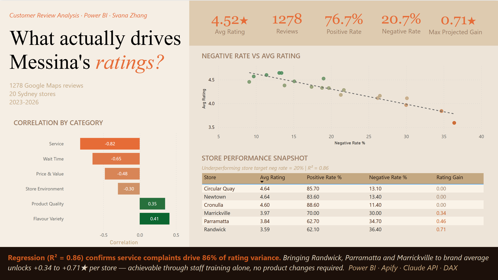
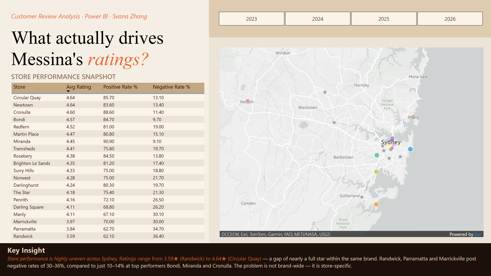
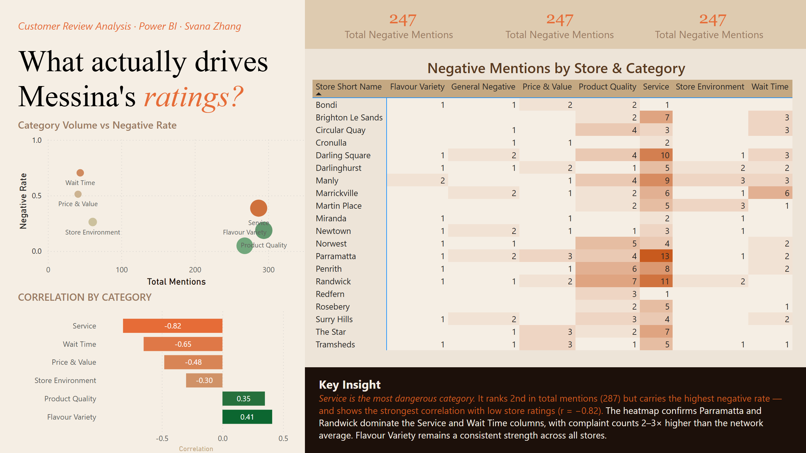
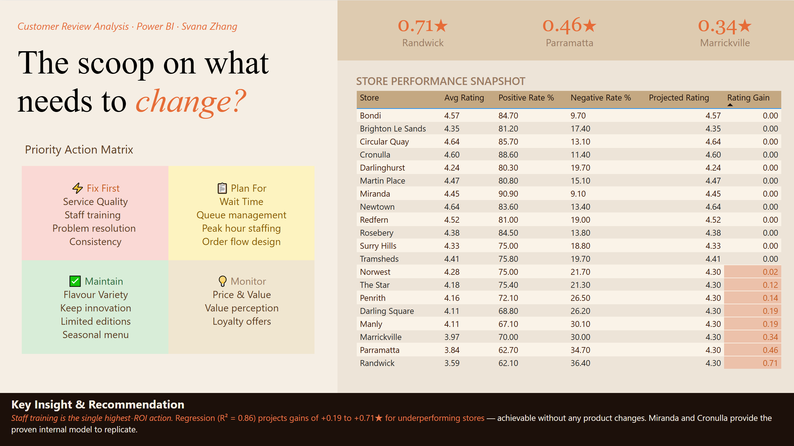

# Gelato Messina — Customer Review Analysis

> **4.52★ overall. A 1-star gap hiding inside it.**  
> An end-to-end customer review analysis built to identify what drives store-level rating differences across Gelato Messina's 20 Sydney locations.

📄 [Read the full analysis on LinkedIn](#) &nbsp;|&nbsp; 📊 [View Dashboard PDF](dashboard/messina_dashboard.pdf)

---

## Overview

This project combines web scraping, AI-powered NLP classification, and regression modelling to surface actionable operational insights from 1,278 Google Maps reviews.

**Central question:** Why do some Messina stores consistently outperform others — and what would it take to close the gap?

**Key finding:** The gelato isn't the problem. Service experience at 3 specific stores explains the majority of the rating gap — and the fix requires no product changes, no capital investment, and no price adjustments.

---

## Tech Stack

| Tool | Purpose |
|------|---------|
| Apify | Web scraping — Google Maps reviews |
| Claude API | NLP text classification and sentiment labelling |
| Power BI | Data modelling, DAX measures, visualisation |
| DAX | Calculated columns, measures, regression metrics |
| Pearson correlation | Identifying rating drivers by category |
| Linear regression | Projected rating improvement modelling (R² = 0.86) |

---

## Data Pipeline

```
Google Maps
     │
     ▼
Apify scraping
(up to 100 reviews per store, 20 stores)
     │
     ▼
Data cleaning
(filter star-only ratings, remove non-substantive entries)
     │
     ▼
Claude API — NLP classification
(6 categories × positive/negative/neutral sentiment)
     │
     ▼
Power BI — DAX modelling
(store-level metrics, correlation, regression)
     │
     ▼
Dashboards + insights
```

**Final dataset:** 1,278 reviews · 20 stores · Dec 2023 – Mar 2026

---

## Analytical Framework

| Layer | Question | Dashboard |
|-------|---------|-----------|
| Descriptive | What are customers talking about? | Store Overview |
| Correlational | What drives store ratings? | What drives rating? |
| Predictive | What if we fix the biggest problem? | The scoop on what needs to change |

---

## Key Findings

### 1. Store performance is highly uneven

| Store | Avg Rating | Negative Rate |
|-------|-----------|---------------|
| Circular Quay | 4.64★ | 13.1% |
| Newtown | 4.64★ | 13.4% |
| Cronulla | 4.60★ | 11.4% |
| Marrickville | 3.97★ | 30.0% |
| Parramatta | 3.84★ | 34.7% |
| Randwick | 3.59★ | 36.4% |

### 2. Service is the single biggest rating driver

| Category | Correlation | Direction |
|----------|------------|-----------|
| Service | r = −0.82 | Risk |
| Wait Time | r = −0.65 | Risk |
| Price & Value | r = −0.48 | Risk |
| Store Environment | r = −0.30 | Risk |
| Product Quality | r = +0.35 | Asset |
| Flavour Variety | r = +0.41 | Asset |

### 3. Regression model projects significant gains

If Randwick, Parramatta and Marrickville reduce service negative rate to brand average (20%):

| Store | Current | Projected | Gain |
|-------|---------|-----------|------|
| Randwick | 3.59★ | 4.30★ | +0.71★ |
| Parramatta | 3.84★ | 4.30★ | +0.46★ |
| Marrickville | 3.97★ | 4.30★ | +0.34★ |

---

## Dashboards

### Cover — What actually drives Messina's ratings?


### Page 1 — Are all Messina stores created equal?


### Page 2 — What's actually pulling Messina's ratings down?


### Page 3 — The scoop on what needs to change


---

## Limitations

- Store ratings are recalculated from sampled reviews, not live Google Maps scores
- Sample size limited to ~100 reviews per store — stores with fewer reviews may show higher variance
- Regression based on 20 data points — projections are directional estimates, not precise forecasts
- Longitudinal tracking post-intervention would be needed to validate the model

---

## Skills Demonstrated

`Power BI` `DAX` `Apify` `Claude API` `NLP` `Sentiment Analysis` `Pearson Correlation` `Linear Regression` `Data Storytelling` `Dashboard Design`

---

## Author

**Yuxin Zhang** · Data Analytics · Sydney, Australia  
[LinkedIn](#) · [Portfolio](#)
